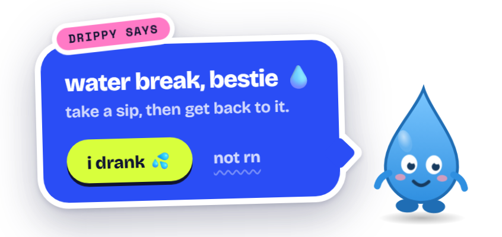

# 💧 DrinkUp

**A tiny desktop app that reminds you to drink water — without getting in your way.**

Your animated buddy lives in the system tray, splashes onto your screen at your chosen interval, drops a nudge, and disappears. No bloat. No subscriptions. Just one `.exe`.

<p align="center">
  <picture>
    <source media="(prefers-color-scheme: dark)" srcset="docs/images/reminder-dark.png">
    
  </picture>
</p>

---

## Download

**[⬇ DrinkUp_0.1.1_x64-setup.exe](https://github.com/aadityasamani/drinkup/releases/latest)**

Windows 10 / 11 · x64 · ~2 MB installer

---

## What it does

At whatever interval you set, a water drop falls into the corner of your screen, splashes, and your buddy springs out of it with a nudge. Click **i drank 💦** or **not rn** and it dives back into the splash. That's it.

It shows up above whatever you're doing, on the screen you're using. Clicks pass straight through while your buddy splashes in and out; while the bubble is up, only that corner of the screen takes clicks.

---

## Features

| | |
|---|---|
| 💦 | **Splash-in reminders** — a drop lands, your buddy pops out with a sticker-style nudge, then dives back in |
| 🎭 | **Your character** — use the built-in mascot or upload any PNG as your own avatar |
| 🌙 | **Dark mode** — toggle live in settings, remembered on restart |
| ⏱️ | **Custom intervals** — presets (15 · 30 · 45 min · 1 hr · 90 min) or any custom timer up to 2 hours |
| 🚀 | **Auto-startup** — seamlessly launches in the background tray on Windows login |
| 📌 | **Always on top** — shows above your apps, even other always-on-top windows, on the screen you're using |
| 🔔 | **Soft sounds** — a water-drop plip on the splash and a gentle chime when the bubble appears |
| ⏸️ | **Pause / Resume** — snooze all reminders when you need deep focus |
| 🗂️ | **Tray-first** — closing the window keeps it running; only Quit exits |

---

## Settings

Right-click the tray icon → **Open Settings**, or double-click it.

- Pick your reminder interval — saved instantly
- Swap the avatar: upload any PNG, rename or remove it anytime
- Test a reminder before committing to an interval
- Pause reminders when you need uninterrupted focus
- Toggle dark / light mode live

---

## How it works

```
Timer fires
  → Transparent overlay appears at the bottom-right corner of the screen you're on
  → A drop falls, splashes, and your buddy springs out of the splash
  → A sticker-style bubble slaps on with a hydration nudge
  → You click "i drank" or "not rn"
  → Buddy hops and dives back into the splash
  → Timer resets
```

Settings are saved to `%APPDATA%\dev.aaditya.drinkup\settings.json`.

---

## Roadmap

- [ ] macOS + Linux support
- [x] Autostart on login
- [ ] Quiet hours / Do Not Disturb schedule
- [ ] More avatar animations and moods
- [ ] Daily hydration goal tracking

---

## For developers

Built with [Tauri 2](https://tauri.app) — Rust backend, vanilla HTML/CSS/JS frontend. No framework, no Electron.

```bash
# Prerequisites: Rust (stable) + Node.js ≥ 18
npm install
npm run dev     # First run compiles Rust — takes a few minutes, then fast
npm run build   # Produces the NSIS installer
```

**Project structure**

```
drinkup/
├── renderer/          # Frontend — HTML, CSS, JS
│   ├── index.html     # Reminder overlay
│   ├── settings.html  # Settings window
│   └── *.js / *.css
└── src-tauri/
    ├── src/lib.rs     # All app logic (tray, windows, IPC)
    └── tauri.conf.json
```

PRs and issues welcome. Open an issue before starting something large.

> Avatars in this repo are original artwork. User-uploaded avatars stay on your device only.

---

## License

MIT — see [LICENSE](LICENSE).
